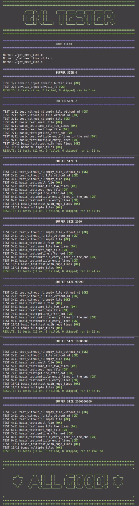

# 42GetNextLineTester

## When something goes wrong you can see what was the expected output.

## SETUP

Clone the repository

    cd 42GetNextLineTester/yourFilesHere
Make a symbolic link to your files, including bonus files if you have done them.

Example:

    ln -s ../../get_next_line/src/get_next_line.c .

Go back to the root of directory and run:

    ./tests/run.sh

or

    ./tests/run.sh bonuns

To run the bonus tests

The script also checks for norm errors, you can comment the last line of `run.sh` to skip the norm check

# Get Next Line - MANDATORY PART

 - Calling your function get_next_line in a loop will then allow you
   to read the text available on a file descriptor one line at a time
   until the EOF.

 - Make sure that your function behaves well when it reads from a file
   and when it reads from the standard input.

 - libft is not allowed for this project. You must add a
   get_next_line_utils.c file which will contain the functions that are
   needed for your get_next_line to work.

 - Your program must compile with the flag -D BUFFER_SIZE=xx. which
   will be used as the buffer size for the read calls in your
   get_next_line. This value will be modified by your evaluators and by
   moulinette.

 - Compilation will be done this way : gcc -Wall -Wextra -Werror -D
   BUFFER_SIZE=32 get_next_line.c get_next_line_utils.c

 - Your read must use the BUFFER_SIZE defined during compilation to read
   from a file or from stdin.

 - In the header file get_next_line.h you must have at least the
   prototype of the function get_next_line.

 - We consider that get_next_line has an undefined behavior if,
   between two calls, the same file descriptor switches to a different
   file before EOF has been reached on the first fd.

 - lseek is not an allowed function. File reading must be done only
   once.

 - Finally we consider that get_next_line has an undefined behavior
   when reading from a binary file. However, if you wish, you can make
   this behavior coherent.  Global variables are forbidden.

# Get Next Line - BONUS PART

 - To succeed get_next_line with a single static variable.

 - To be able to manage multiple file descriptor with your get_next_line. For ex-
       ample, if the file descriptors 3, 4 and 5 are accessible for
       reading, then you can call get_next_line once on 3, once on 4, once
       again on 3 then once on 5 etc. without losing the reading thread on
       each of the descriptors.

# Thirdy-part library
 - [CTEST](https://github.com/bvdberg/ctest)
